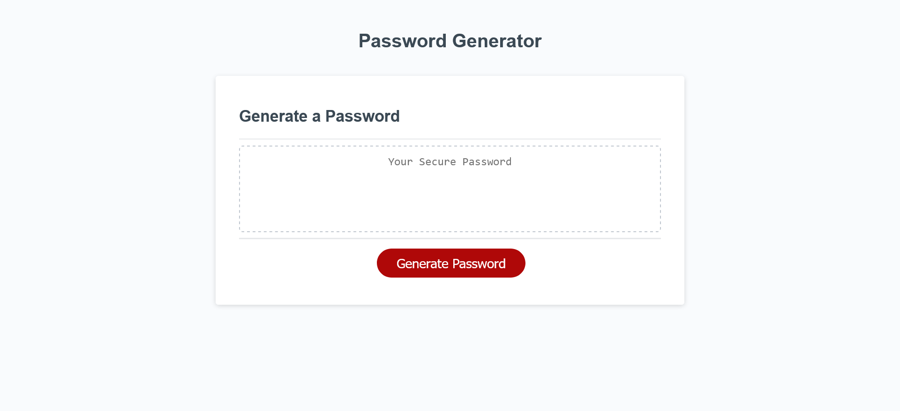

# Random-Password-Generator
Link: https://dequand.github.io/Random-Password-Generator/ 
Description: A random password generator that allows the user to determine the length of the password as well as specify the whether to use uppercase and lowercase letters, numbers and special characters.
The generator is built using HTML, CSS and Javascript

